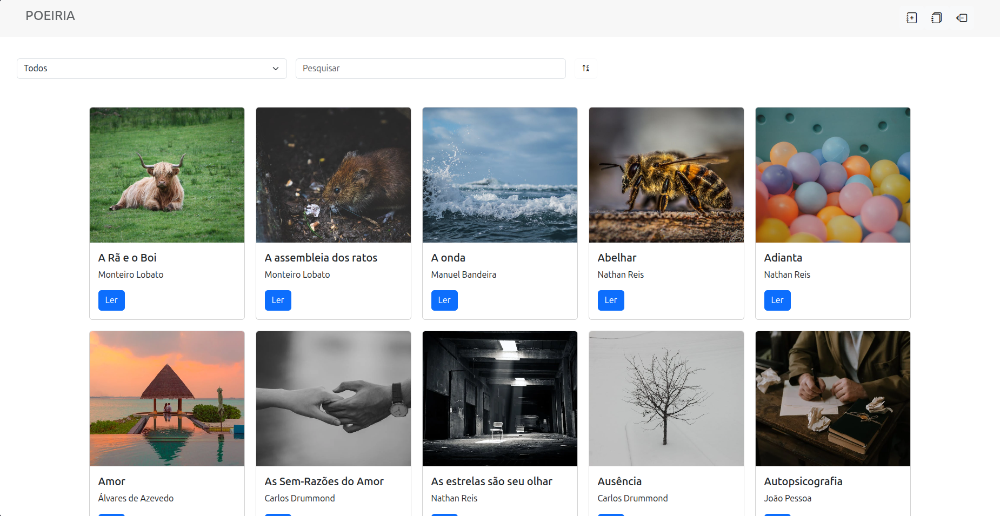

# Poeiria

Poeiria é um projeto de software como **desenvolvedor Full Stack** para mostrar **poemas** de diversos escritores e pode publicar seus próprios poemas, é uma forma simples de registrar ideias e mostrá-las. Isto é um projeto pessoal, apenas para uso próprio.

Divirta-se e desenvolva sua criatividade, treine sua escrita e aprenda com os diferentes pontos de vistas e estilos de escrita.

## 🧩 Stack

### Frontend

### Backend / Serviços

